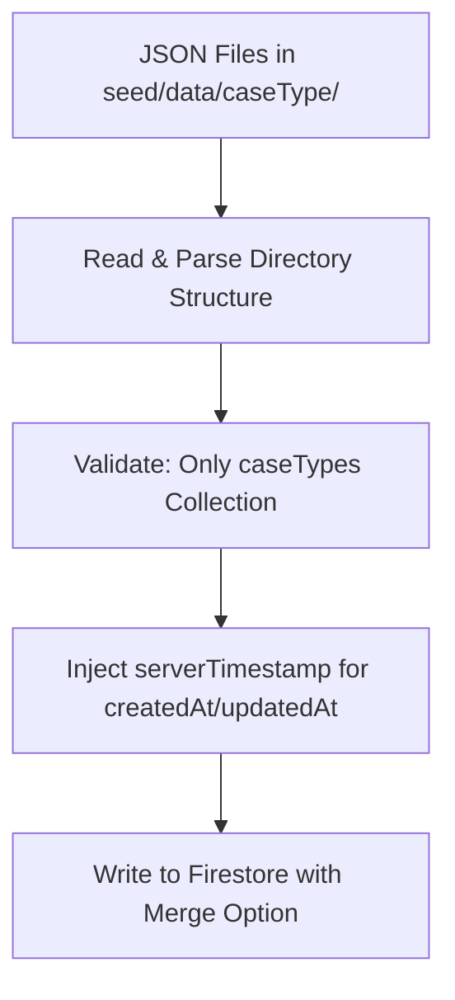

# CaseType Seeder System

## Architecture

The seeder will:

1. Read JSON files from `seed/data/caseType/{caseTypeId}/` directory structure
2. Parse folder hierarchy to identify main documents and subcollections
3. Use Firebase Admin SDK to sync data to Firestore
4. Support merge mode to preserve existing data (default)
5. Auto-inject timestamps using `serverTimestamp()`
6. Include comprehensive security checks:

- Only operate on `caseTypes` collection (hardcoded whitelist)
- Prevent path traversal attacks
- Validate JSON size and structure
- Exclude from Next.js builds to prevent credential leakage

## File Structure

```
seed/
├── data/
│   └── caseType/
│       └── death_certificate_flow/
│           ├── doc.json                          # Main caseType document
│           ├── sourceDocuments/                  # Subcollection
│           │   └── death_certificate_image.json
│           └── templates/                        # Subcollection
│               └── social_security.json
└── seed.ts                                       # Main seeding script
```

**Note:** Reuses existing [apps/web/lib/firebase-admin.ts](apps/web/lib/firebase-admin.ts) - no need to duplicate admin SDK setup.

## Data Flow



## Implementation Details

### 1. Seed Script ([seed/seed.ts](seed/seed.ts))

The script will:

- Accept `--no-merge` CLI flag to disable merge (default: merge enabled)
- Recursively scan `seed/data/caseType/` directory
- For each caseTypeId folder:
  - Read `doc.json` → main caseType document
  - Read subcollection folders (sourceDocuments, templates) → subcollection documents
- Auto-inject timestamps using `admin.firestore.FieldValue.serverTimestamp()`:
  - `createdAt`: Only set when document doesn't exist yet
  - `updatedAt`: Always set on every write
- Security validations:
  - Path traversal prevention: `path.resolve()` + startsWith check
  - Collection whitelist: Hardcoded `ALLOWED_COLLECTIONS = ['caseTypes']`
  - JSON size limits: 5MB max per file (checked before read)
  - JSON depth limits: 10 levels max (recursive validation)
  - Required field validation: Ensure document IDs match schema
  - Early exit on any security violation
- Import admin SDK from [apps/web/lib/firebase-admin.ts](apps/web/lib/firebase-admin.ts)

### 2. Firebase Admin Setup

- Reuse existing [apps/web/lib/firebase-admin.ts](apps/web/lib/firebase-admin.ts)
- Import path: `../apps/web/lib/firebase-admin`
- Already configured with proper credentials from `.env` file

### 3. Example JSON Files

Based on [docs/system/FIRESTORE_STRUCTURE.md](docs/system/FIRESTORE_STRUCTURE.md):

**seed/data/caseType/death_certificate_flow/doc.json:**

```json
{
  "caseTypeId": "death_certificate_flow",
  "name": "Death Certificate Processing",
  "description": "Process death certificates and generate administrative documents",
  "fields": { ... },
  "isActive": true,
  "deletedAt": null
}
```

**seed/data/caseType/death_certificate_flow/sourceDocuments/death_certificate_image.json:**

```json
{
  "sourceDocumentTypeId": "death_certificate_image",
  "name": "Death Certificate Image",
  "extractsFields": [...],
  "acceptedMimeTypes": ["image/jpeg", "image/png"],
  "maxFileSizeMB": 10,
  "isActive": true,
  "deletedAt": null
}
```

### 4. TypeScript Execution & Build Isolation

The script runs via `tsx` at the project root level (outside Next.js app directory).

**Critical**: Update [apps/web/tsconfig.json](apps/web/tsconfig.json) to exclude seed/:

```json
{
  "exclude": ["node_modules", "../../seed"]
}
```

This prevents:

- Seed script from being included in Next.js builds
- Admin SDK imports from leaking into client bundle
- Build errors from CLI-only code

### 5. CLI Usage

```bash
# Default: merge mode (preserves existing data)
npm run seed

# Overwrite mode (replaces entire documents)
npm run seed -- --no-merge

# Or directly
npx tsx seed/seed.ts
npx tsx seed/seed.ts --no-merge
```

### 6. Security & Safety Mechanisms

**Collection Safety:**

- Hardcoded whitelist: Only `caseTypes` collection allowed
- Validate collection path before any write operation
- Reject any attempt to access other collections

**Path Traversal Prevention:**

- Use `path.resolve()` to get canonical paths
- Verify all file paths stay within `seed/data/caseType/`
- Reject paths containing `..` or absolute paths

**JSON Safety:**

- Max file size: 5MB per JSON file
- Max nesting depth: 10 levels (prevent DoS)
- Validate JSON structure before parsing
- Required fields validation (caseTypeId, sourceDocumentTypeId, templateId)

**Build Isolation:**

- Add `seed` to Next.js tsconfig.json exclude list
- Prevents seed script from being included in Next.js bundle
- Avoids credential leakage in client builds

**Data Sanitization:**

- Seed data is committed to repo (contains only non-sensitive config data)
- Do not include any user data, credentials, or API keys in JSON files
- Keep only configuration schemas and templates

## Security Considerations

### Vulnerabilities Addressed

1. **Build Inclusion Risk (HIGH)**: Add `seed` to Next.js tsconfig exclude to prevent:

- Seed script being bundled with client code
- Admin credentials leaking into browser bundle
- Unnecessary build artifacts

1. **Path Traversal (MEDIUM)**: Validate all file paths using:

- `path.resolve()` for canonical paths
- Check paths start with `seed/data/caseType/`
- Reject `..` and absolute paths

1. **JSON DoS (MEDIUM)**: Protect against malicious JSON:

- 5MB file size limit
- 10-level nesting depth limit
- Timeout on JSON.parse operations

1. **Collection Access (HIGH)**: Prevent database damage:

- Hardcoded whitelist: only `caseTypes`
- Validate collection name before every write
- No collection group queries allowed

1. **Data Leakage (LOW)**: Seed data committed to repo:

- Only contains non-sensitive config schemas
- No user data, credentials, or API keys
- Safe to commit publicly

### What's NOT a Risk

- **Admin SDK credentials**: Only loaded from `.env` (gitignored, server-only)
- **Runtime environment**: Script runs locally via CLI, never in browser
- **User input**: No user-provided data, only predefined JSON files

## Dependencies

Add to root [package.json](package.json):

```json
{
  "devDependencies": {
    "tsx": "^4.x.x"
  },
  "scripts": {
    "seed": "tsx seed/seed.ts"
  }
}
```

## Key Implementation Details

### Security Validation Functions

```typescript
validatePath(filePath: string): void
  - Resolve to canonical path using path.resolve()
  - Verify startsWith(projectRoot + '/seed/data/caseType/')
  - Throw SecurityError if validation fails

validateCollection(collection: string): void
  - Check against ALLOWED_COLLECTIONS = ['caseTypes']
  - Throw SecurityError if not whitelisted

validateJSON(content: string, filePath: string): object
  - Check file size < 5MB before read
  - Parse JSON with error handling
  - Recursively check nesting depth <= 10 levels
  - Return validated parsed object

validateDocumentId(doc: any, expectedField: string): void
  - Ensure document has required ID field
  - Validate ID format matches schema conventions
```

### Timestamp Handling

Use `admin.firestore.FieldValue.serverTimestamp()`:

- Check if document exists before write
- If exists: Only update `updatedAt`, preserve existing `createdAt`
- If new: Set both `createdAt` and `updatedAt`

### Merge Behavior

Default `merge: true` (use `--no-merge` to disable):

- Merge enabled: Existing fields not in JSON are preserved
- Merge disabled: Entire document replaced

### Error Handling

- Log each operation: collection/doc path, status, timing
- Continue on individual failures
- Report summary: total ops, successes, failures
- Exit code 1 if any failures
