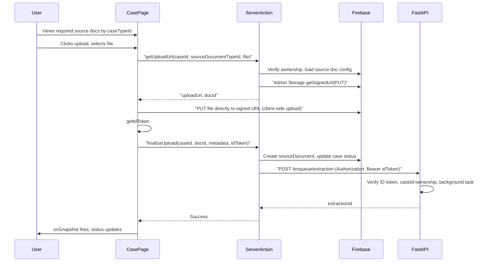

# Source Document Upload Feature Plan

## Current State

- **Case page** ([apps/web/app/(app)/cases/[caseId]/page.tsx](apps/web/app/(app)/cases/[caseId]/page.tsx)): Placeholder content area; case has `caseTypeId`, `status` (draft → open → extracting → extracted → failed)
- **Case types & source documents**: Config in `caseTypes/{caseTypeId}/sourceDocuments/{sourceDocumentTypeId}` (e.g. `death_certificate_image` with `name`, `description`, `acceptedMimeTypes`, `maxFileSizeMB`); seeded from [seed/data/caseType/death_certificate_flow/sourceDocuments/death_certificate_image.json](seed/data/caseType/death_certificate_flow/sourceDocuments/death_certificate_image.json)
- **Storage**: Firebase Storage initialized; Admin SDK has Auth + Firestore only (no Storage). Storage rules deny all; uploads use Admin SDK signed URLs (bypass rules)
- **Enqueue API**: FastAPI has no `/enqueue/extraction` route yet; Next.js will call it at `ENQUEUE_API_URL`. FastAPI will verify ID token + caseId, create extraction doc, and dispatch a **background job** (not Cloud Tasks). An **extraction service** will be used by the background job; the route will be commented that it is meant to be replaced with Cloud Task/worker per architecture docs.

---

## Architecture




---

## Implementation

### 1. Firestore: Fetch Source Documents by Case Type

**New module**: `apps/web/lib/firestore/source-documents.ts`

- `getSourceDocumentsForCaseType(caseTypeId)`: Read `caseTypes/{caseTypeId}/sourceDocuments` where `isActive == true` and `deletedAt == null`
- Return `SourceDocumentType[]`: `sourceDocumentTypeId`, `name`, `description`, `acceptedMimeTypes`, `maxFileSizeMB`

Use Firestore client SDK (same as cases) since config is readable by authenticated users per [docs/system/FIRESTORE_RULES.md](docs/system/FIRESTORE_RULES.md).

---

### 2. Firebase Admin Storage Setup

**File**: [apps/web/lib/firebase-admin.ts](apps/web/lib/firebase-admin.ts)

- Import and initialize `admin.storage()`; export `adminStorage`
- Use `process.env.FIREBASE_STORAGE_BUCKET` (required). If not set, throw at init – same as `FIREBASE_PROJECT_ID`; no fallback to appspot.com

---

### 3. Server Actions: Upload Flow

**File**: `apps/web/actions/uploads.ts` (new)

`**getUploadUrl(caseId, sourceDocumentTypeId, fileName, mimeType, fileSizeBytes)`**

1. `verifySession()` → get `userId`
2. Load case: verify `userId` owns case (allow any status – re-upload is supported)
3. Load `caseTypes/{caseTypeId}/sourceDocuments/{sourceDocumentTypeId}`: validate mimeType in `acceptedMimeTypes`, `fileSizeBytes <= maxFileSizeMB * 1024 * 1024`
4. Generate `docId` = `doc_${nanoid}` or Firestore auto-ID
5. Storage path: `cases/{caseId}/attachments/{docId}.{ext}` (derive ext from fileName/mimeType)
6. Use `@google-cloud/storage` or Firebase Admin Storage `getSignedUrl()` with method `PUT`, content-type header, short expiry (e.g. 15 min)
7. Return `{ uploadUrl, docId, storagePath }`

`**finalizeUpload(caseId, docId, sourceDocumentTypeId, fileName, mimeType, fileSizeBytes, storagePath, idToken)`**

1. `verifySession()` → get `userId`
2. Verify case ownership
3. **Verify file exists in Storage** at `storagePath` (Admin Storage `file().exists()`). If not found → return error `"Something went wrong, please upload again."` (safeguard; should not occur since finalize runs after client upload success)
4. Batch Firestore writes:
  - Set `isLatest: false` on existing `cases/{caseId}/sourceDocuments` docs **with the same `sourceDocumentTypeId`**
  - Create `cases/{caseId}/sourceDocuments/{docId}` with: `docId`, `caseId`, `userId`, `sourceDocumentTypeId`, `isLatest: true`, `fileName`, `storagePath`, `mimeType`, `fileSizeBytes`, `uploadedAt`
  - Update case: `status: "open"`, `updatedAt`
5. Call enqueue API: `POST {ENQUEUE_API_URL}/enqueue/extraction` with body `{ caseId, sourceDocumentId: docId }`, header `Authorization: Bearer {idToken}`
6. Return `{ success: true }` or error

**Note**: Client must obtain `idToken` via `auth.currentUser.getIdToken()` and pass it to this action. FastAPI verifies the token and case ownership.

**Dependencies**: Add `@google-cloud/storage` if Firebase Admin Storage does not expose `getSignedUrl` for PUT, or use the underlying GCS API. Firebase Admin v12+ wraps GCS; `bucket.file(path).getSignedUrl()` supports `action: 'write'`.

---

### 4. Enqueue API Client (Next.js)

**File**: `apps/web/lib/enqueue-api.ts` (new)

```typescript
export async function enqueueExtraction(caseId: string, sourceDocumentId: string, idToken: string): Promise<{ extractionId: string }>
```

- `fetch(\`${ENQUEUE_API_URL}/enqueue/extraction, { method: 'POST', headers: { 'Authorization': Bearer ${idToken}, 'Content-Type': 'application/json' }, body: JSON.stringify({ caseId, sourceDocumentId }) })`
- Parse response; throw on non-2xx

**Env**: `ENQUEUE_API_URL` (e.g. `http://localhost:8000` or production API base URL)

---

### 5. FastAPI: Enqueue Extraction Route + Background Job

**Note**: FastAPI app uses **uv** for dependency management (`pyproject.toml`, `uv add` for new deps). Config values (e.g. `FIREBASE_STORAGE_BUCKET`, `OPENAI_API_KEY`) come from [api/app/config.py](api/app/config.py), not `os.getenv` directly.

**New route**: `api/app/routes/enqueue.py` (or under `api/app/routes/`)

**POST /enqueue/extraction**

- **Auth**: Extract `Authorization: Bearer <id_token>`; call `verify_id_token(id_token)` (existing in [api/app/services/firebase.py](api/app/services/firebase.py))
- **Body**: `{ caseId, sourceDocumentId }`
- **Verification**: Load case from Firestore; ensure `case.userId == decoded_token["uid"]`
- **Create extraction doc**: `extractions/{extractionId}` with `extractionId`, `caseId`, `userId`, `caseTypeId`, `sourceDocumentTypeId`, `caseSourceDocumentId`, `version: 1`, `status: "pending"`
- **Background job**: `BackgroundTasks.add_task(run_extraction, extraction_id)` (or similar)
- **Return**: `{ extractionId }`
- **Comment on route**: "TODO: Replace background job with Cloud Task/worker implementation per ARCHITECTURE.md and USER_FLOWS.md"

**Extraction service**: `api/app/services/extraction_service.py`

- `run_extraction(extraction_id: str)`: Sync function that performs the extraction workflow:
  - Load extraction doc, case, case type, source document config
  - Update extraction status to `extracting`; update case status
  - Generate a signed read URL for the blob in Firebase Storage (`get_signed_read_url`, 15 min expiry)
  - Call OpenAI **Chat Completions** API (`client.chat.completions.create`) with the signed URL as `image_url` (no download or base64)
  - Use **structured output** via `response_format` with `json_schema`: schema built by `_build_extraction_schema(extracts_fields, fields_config)` from case type config
  - Prompt from `api/app/prompts/extraction.py` via `build_extraction_prompt(field_descriptions)` (tuned for schema-driven extraction)
  - Handle refusal via `message.refusal`; validate extracted values (JSON Schema + custom validators)
  - Update extraction and case in Firestore
- This service will be reusable when the route is migrated to Cloud Task: the worker handler will call the same service.

---

### 6. Case Page UI: Source Document Upload

**Replace placeholder** in [apps/web/app/(app)/cases/[caseId]/page.tsx](apps/web/app/(app)/cases/[caseId]/page.tsx):

- Fetch source documents for `caseData.caseTypeId`; render card per source document type (name, description, accepted types, max size)
- **Upload UI**: Always show upload button (re-upload allowed). Client uploads **directly to signed URL** via `fetch(uploadUrl, { method: 'PUT', body: file })` – no server relay
- On file select: validate client-side (mime, size), call `getUploadUrl`, then `PUT` from client to `uploadUrl`, then on success call `finalizeUpload` with `docId`, file metadata, and `idToken`
- When document already exists: show current file info + "Replace" / re-upload option

**Component**: `SourceDocumentUpload` in `apps/web/components/cases/source-document-upload.tsx`

- Props: `caseId`, `caseTypeId`, `caseStatus`
- Fetches source document types (or receives as prop)
- File input (hidden) + button; on change → upload flow
- Uses `getUploadUrl` and `finalizeUpload` server actions

---

### 7. Firestore: Case Type ID on Client

The case page subscribes to the case via `listenToCase`. Extend `CaseData` (or the Case type) to include `caseTypeId` so the upload component knows which source documents to show. Currently `CaseData` does not include `caseTypeId` in [apps/web/lib/firestore/cases.ts](apps/web/lib/firestore/cases.ts); add it to the mapped response.

---

## Data Flow Summary


| Step | Actor         | Action                                                                                           |
| ---- | ------------- | ------------------------------------------------------------------------------------------------ |
| 1    | Case page     | Load source documents for `caseTypeId`; show upload UI                                           |
| 2    | User          | Select file; client validates mime/size                                                          |
| 3    | Server action | `getUploadUrl` → validate, generate signed PUT URL, return `{ uploadUrl, docId, storagePath }`   |
| 4    | Client        | `fetch(uploadUrl, { method: 'PUT', body: file })`                                                |
| 5    | Client        | On 2xx: get idToken, call `finalizeUpload(caseId, docId, ..., idToken)`                          |
| 6    | Server action | Create source doc, update case status, POST to enqueue API with idToken                          |
| 6b   | FastAPI       | Verify id token, case ownership; create extraction doc; add background task (extraction service) |
| 7    | Client        | `listenToCase` fires; status becomes `open` → `extracting` → `extracted`                         |


---

## Environment Variables


| Variable                  | Location | Purpose                                                                                                   |
| ------------------------- | -------- | --------------------------------------------------------------------------------------------------------- |
| `ENQUEUE_API_URL`         | Next.js  | Base URL for FastAPI (e.g. `http://localhost:8000`)                                                       |
| `FIREBASE_STORAGE_BUCKET` | Next.js  | **Required.** Storage bucket name (e.g. `my-project.appspot.com`). No fallback; if unset, project breaks. |
| `FIREBASE_STORAGE_BUCKET` | FastAPI  | **Required.** Same as above; read via [api/app/config.py](api/app/config.py)                              |
| `OPENAI_API_KEY`          | FastAPI  | **Required** for extraction; read via config.py                                                           |


Add `ENQUEUE_API_URL` and `FIREBASE_STORAGE_BUCKET` to [apps/web/.env.example](apps/web/.env.example). FastAPI uses [api/app/config.py](api/app/config.py) for `FIREBASE_STORAGE_BUCKET`, `OPENAI_API_KEY`, etc.

---

## Files to Create/Modify


| File                                                   | Action                                                                                           |
| ------------------------------------------------------ | ------------------------------------------------------------------------------------------------ |
| `apps/web/lib/firestore/source-documents.ts`           | Create – fetch source doc types by case type                                                     |
| `apps/web/lib/firebase-admin.ts`                       | Modify – add `adminStorage`                                                                      |
| `apps/web/actions/uploads.ts`                          | Create – `getUploadUrl`, `finalizeUpload`                                                        |
| `apps/web/lib/enqueue-api.ts`                          | Create – `enqueueExtraction` (idToken auth)                                                      |
| `apps/web/components/cases/source-document-upload.tsx` | Create – upload UI                                                                               |
| `apps/web/app/(app)/cases/[caseId]/page.tsx`           | Modify – integrate `SourceDocumentUpload`, pass `caseTypeId`                                     |
| `apps/web/lib/firestore/cases.ts`                      | Modify – add `caseTypeId` to `CaseData` / listener response                                      |
| `api/app/routes/enqueue.py`                            | Create – POST /enqueue/extraction with ID token + caseId verification, background job            |
| `api/app/services/extraction_service.py`               | Extraction: signed URL → Chat Completions + structured output (json_schema), validate, Firestore |
| `api/app/prompts/extraction.py`                        | `build_extraction_prompt(field_descriptions)` – prompt tuned for schema-driven extraction        |
| `api/app/services/firebase.py`                         | Add `get_signed_read_url(storage_path, expiry_minutes)` for signed read URLs                     |
| `api/app/main.py`                                      | Modify – include enqueue router                                                                  |
| `apps/web/.env.example`                                | Modify – add `ENQUEUE_API_URL`, `FIREBASE_STORAGE_BUCKET`                                        |


---

## Key Behaviours (Aligned)

- **Re-upload**: Allowed; user can replace source document at any time. Finalize sets `isLatest: false` on docs with the same `sourceDocumentTypeId`, then creates new doc with `isLatest: true`
- **Upload path**: Client PUTs **directly** to signed URL (no server relay). Server action only generates the URL
- **isLatest**: Only docs with matching `sourceDocumentTypeId` are updated on finalize
- **Storage verification**: Finalize verifies file exists in Storage before creating Firestore records; if missing, returns "Something went wrong, please upload again." (safeguard)

---

## Out of Scope (Assumptions)

- **Cloud Tasks / worker**: Enqueue route uses FastAPI BackgroundTasks for now; route is commented for future Cloud Task migration per architecture docs.
- **Multi-document types**: UI supports multiple source document types per case type; finalize handles one upload per call.

---

## Implementation Notes (Updated after implementation)

*This section reflects the actual implementation. Changes from the original plan are noted below.*

### Enqueue API Client (`apps/web/lib/enqueue-api.ts`)

- **User-facing errors**: All failures (API unreachable, 401, 5xx, missing `ENQUEUE_API_URL`) surface a single message: *"Failed to upload image, please try again later."* Technical details are not exposed to users.
- **Timeout**: 15-second fetch timeout via `AbortController` to avoid indefinite hang when the FastAPI API is unreachable.

### Upload UI (`apps/web/components/cases/source-document-upload.tsx`)

- **Error handling**: `handleFileSelect` wrapped in `try/catch/finally`; `setUploadingTypeId(null)` always runs in `finally` so the UI never stays stuck on "Uploading".
- **Generic catch**: Any uncaught error (e.g. server action rejection) shows *"Failed to upload image, please try again later."*

### Firebase API (`api/app/services/firebase.py`)

- **Project ID for auth**: `initialize_app()` requires a project ID for token verification. Added `_get_project_id()` which:
  - Uses `FIREBASE_PROJECT_ID` or `GOOGLE_CLOUD_PROJECT` if set
  - Otherwise reads `project_id` from the service account JSON (local dev)
- **Config** (`api/app/config.py`): Added optional `FIREBASE_PROJECT_ID` (falls back to `GOOGLE_CLOUD_PROJECT`).

### Source Document Query (`apps/web/lib/firestore/source-documents.ts`)

- **Auth timing**: Load waits on `onAuthStateChanged` before querying Firestore.
- **Query**: Fetches all docs and filters in memory (no composite `where` filters) for compatibility with Firestore rules.

### Firestore Rules

- Rules updated to allow read access to: `caseTypes`, `caseTypes/.../sourceDocuments`, `caseTypes/.../templates`, `cases/.../sourceDocuments`, `extractions`, `generations`.
- `cases/{caseId}/sourceDocuments` list rule uses `get()` on parent case for ownership checks (avoids `resource.data` on empty subcollection).

### Storage CORS

- `firebase/storage.cors.json` added for client upload to GCS. Applied via `gsutil cors set` (manual step).

### Minor Implementation Details

- **docId**: Uses `doc_${randomBytes(12).toString("base64url")}` (not nanoid).

