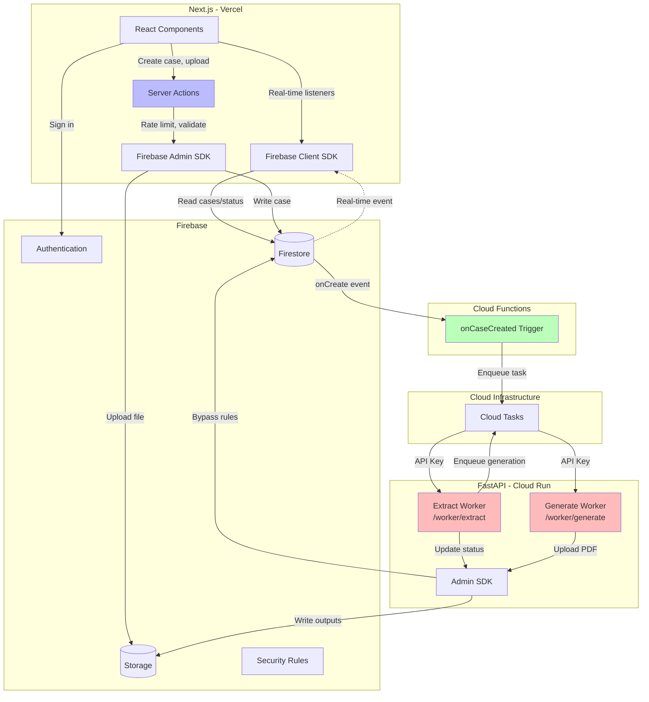

# Project Architecture

## System Overview

## Component Responsibilities

### Next.js (Vercel)

**Client Components:**

- Firebase Auth (sign-in, sign-out, session management)
- Real-time listeners for case status and generation progress
- UI rendering (shadcn components)

**Server Actions (Firebase Admin SDK):**

- Case creation with rate limiting
- File upload validation (size, type checks)
- Email notifications (Resend)
- Audit logging
- Multi-document transactions

### Firebase

**Authentication:** Google OAuth, email/password  
**Firestore:** Case metadata, extraction results, generation status  
**Storage:** Source documents, generated PDFs, templates  
**Security Rules:** Enforce user can only access their own data

### Cloud Functions

**Firestore Triggers:**

- `onCaseCreated`: Fires when new case document created
- Enqueues extraction task to Cloud Tasks
- Deployed separately: `firebase deploy --only functions`

### FastAPI Workers (Cloud Run)

**Extract Worker:**

- Download source document from Storage
- GPT-4 Vision extraction → structured fields
- Validation (date consistency, format checks)
- Update Firestore with results
- Enqueue generation if auto-approved

**Generate Worker:**

- Fetch template from Storage
- Render with extracted data
- Convert .docx → PDF
- Upload to Storage
- Update generation status

**Admin Endpoints:**

- `/admin/retry-extraction` - Manual re-extraction (prompt changes, recovery)
- `/admin/retry-generation` - Regenerate specific templates
- Authenticated with Firebase ID token + admin role
- Internally enqueues Cloud Tasks (API key stays isolated)

### Cloud Tasks

- Queue extraction jobs (triggered by Firestore onCreate)
- Queue generation jobs (enqueued by extract worker)
- API key authentication to FastAPI workers

## Key Design Decisions

**Firebase Client SDK:** Real-time updates without polling, offline support  
**Firebase Admin SDK in Server Actions:** Server-side validation, rate limiting, email triggers  
**Security Rules:** Authorization layer prevents unauthorized data access  
**FastAPI for compute only:** Separates business logic from heavy processing  
**API Keys:** Secure worker endpoints, manual triggering, infrastructure-agnostic  
**Firestore triggers:** Automatic workflow execution on case creation

## Data Flow: Case Creation

1. User uploads document in Next.js
2. Server Action validates file → writes case to Firestore via Admin SDK
3. Firestore trigger fires on case creation
4. Cloud Tasks enqueues extraction job
5. Extract worker processes document, updates Firestore
6. Client `onSnapshot` listener updates UI in real-time
7. If approved, extract worker enqueues generation jobs
8. Generate workers produce PDFs, upload to Storage
9. Client listeners show download links

## Security Model

**Firestore Rules:** Users read/write only their cases (`userId == request.auth.uid`)  
**Storage Rules:** Users access only their paths (`/source-documents/{userId}/...`)  
**Worker endpoints:** OIDC tokens from Cloud Tasks only (not publicly accessible)  
**Admin SDK operations:** Bypass rules for status updates (workers trusted, users not)

## Technology Stack

- **Frontend:** Next.js 16, React, shadcn/ui, Tailwind CSS
- **Backend:** FastAPI, Python 3.11
- **Database:** Firestore
- **Storage:** Firebase Storage
- **Auth:** Firebase Authentication
- **Email:** Resend
- **Compute:** Cloud Run, Cloud Tasks
- **AI:** OpenAI GPT-4 Vision
- **Deployment:** Vercel (frontend), GCP (backend)
