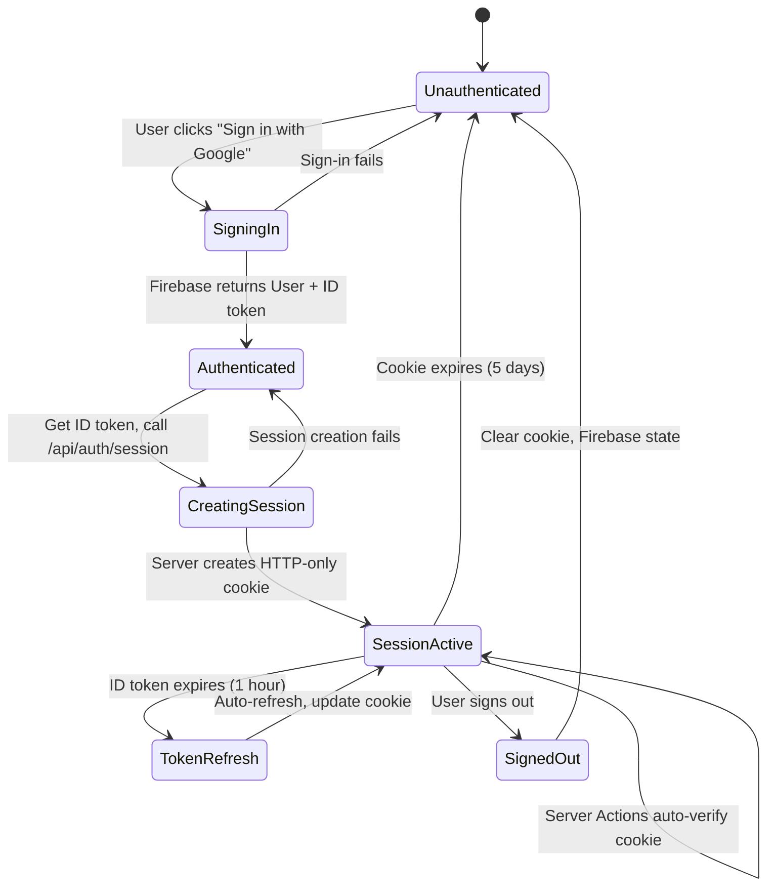
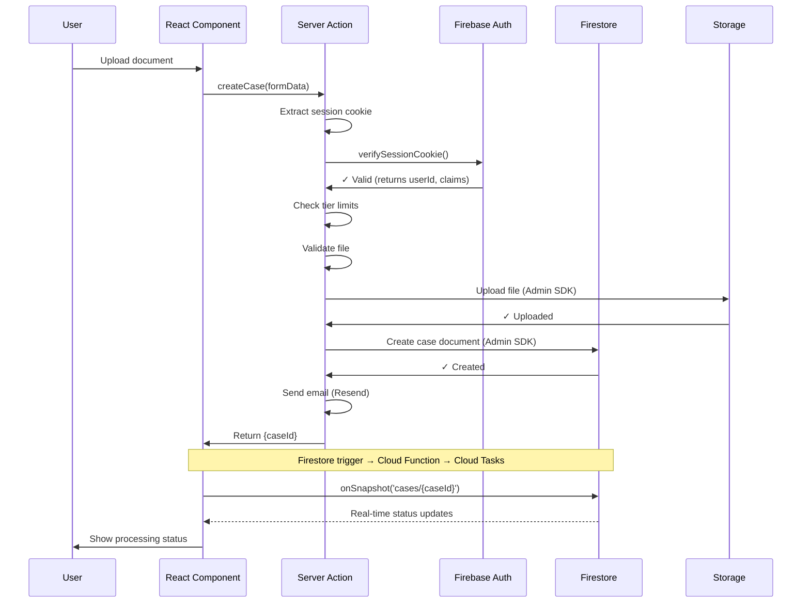

# Project Authentication Architecture

## How Authentication Works

Project uses different authentication mechanisms based on what component needs access to what resource:

| Component        | Accessing         | Auth Method                 | Why This Way                                |
| ---------------- | ----------------- | --------------------------- | ------------------------------------------- |
| React Components | Auth State        | Client SDK                  | Firebase handles persistence, token refresh |
| React Components | Real-time Data    | Client SDK + Security Rules | `onSnapshot` requires client SDK            |
| Server Actions   | Firestore/Storage | Admin SDK + Session Cookies | Validation, rate limiting, audit logs       |
| Cloud Functions  | Cloud Tasks       | Service Account             | Auto-authenticated by GCP                   |
| Cloud Tasks      | FastAPI           | API Key (Secret Manager)    | Manual triggering, infra-agnostic           |
| FastAPI Workers  | Firestore/Storage | Admin SDK                   | Bypasses rules for trusted operations       |

---

## User Authentication Flow



**Flow breakdown:**

1. User signs in via Firebase Client SDK (`signInWithPopup`)
2. Client gets ID token and calls `/api/auth/session` endpoint
3. Server verifies ID token, creates session cookie (HTTP-only, 5-day expiry)
4. All future Server Actions verify session cookie via Admin SDK
5. Client maintains auth state via `onAuthStateChanged` listener
6. Firebase SDK auto-refreshes ID token every hour, syncs with session cookie

---

## Server Action Data Flow



**Key points:**

- Session verification happens **before** any data operation
- Admin SDK bypasses Security Rules (session already verified)
- Client listens for real-time updates via `onSnapshot()`
- No direct client writes to Firestore/Storage

---

## Why This Architecture

### Client SDK for Real-time, Admin SDK for Server Operations

**How it works:**

- React components use Client SDK `onSnapshot()` for live case status updates
- Server Actions use Admin SDK for all Firestore/Storage reads and writes
- Real-time listeners update UI instantly when workers modify Firestore

**Why:**

- `onSnapshot()` requires Client SDK—can't be done in Server Actions
- Server Actions enable validation, rate limiting, emails, audit logs before writes
- Admin SDK in Server Actions avoids Security Rules overhead (session already verified)
- Clear separation: client for presentation, server for business logic

**Trade-off:**

- Client can't write offline (Server Actions need network)
- Network hop for writes adds ~50-100ms latency
- Benefit: All writes validated, logged, rate-limited server-side

### Firebase Session Cookies

**How it works:**

```typescript
// Client calls after sign-in
await fetch("/api/auth/session", {
  headers: { Authorization: `Bearer ${idToken}` },
});
// Server verifies token, creates session cookie
```

**Why session cookies over storing tokens:**

- HTTP-only cookies immune to XSS (localStorage vulnerable)
- Automatic CSRF protection with SameSite=Lax
- 5-day expiry reduces re-auth friction
- Admin SDK `verifySessionCookie()` is fast (public keys cached)

**Trade-off:**

- Extra sign-in step (ID token → session conversion)
- Multi-domain deployments need shared cookie domain
- Benefit: Secure by default, no token leakage via client-side JavaScript

### API Keys for Cloud Tasks → FastAPI

**How it works:**

- API key stored in GCP Secret Manager
- Cloud Functions read key, attach to Cloud Tasks as `X-API-Key` header
- FastAPI reads same key from Secret Manager, validates match
- Worker endpoint rejects requests without valid key

**Why API keys over OIDC:**

- Manual triggering for debugging: `curl -H "X-API-Key: ..." /worker/extract`
- Infrastructure-agnostic: move FastAPI to AWS/Railway without changing auth
- Simpler implementation (no token verification logic)
- Sufficient security for worker endpoints (not public-facing)

**Trade-off:**

- Manual key rotation (OIDC auto-rotates)
- Keys logged by default (requires redaction config)
- Migration to OIDC later takes ~2 hours if security audit requires it

**Security considerations:**

- Key redacted from logs (FastAPI + Cloud Run config)
- Key only accessible to Cloud Functions and FastAPI (IAM permissions)
- Worker endpoints still not publicly discoverable (no direct routes)

### Cloud Functions for Firestore Triggers

**How it works:**

- Firestore `onCreate` event for `cases/{caseId}` triggers Cloud Function
- Function reads API key from Secret Manager
- Function enqueues Cloud Tasks with API key header
- Deployed separately: `firebase deploy --only functions`

**Why separate Cloud Functions:**

- Firestore triggers are GCP-native, auto-scale
- Service account authentication automatic
- Decouples trigger logic from Next.js and FastAPI codebases
- Cold starts acceptable for async workflows (~1s)

**Trade-off:**

- Additional deployment to manage
- Trigger logic separate from main application
- Benefit: Clean separation of event handling from business logic

---

## Feature Access Control

### Custom Claims for Tier Limits

**How it works:**

```typescript
// Server Action verifies session, checks tier
const claims = await admin.auth().verifySessionCookie(session);
if (claims.tier === "free" && caseCount >= 3) {
  throw new Error("Free tier limit");
}
```

**Why custom claims:**

- Embedded in session token—no extra Firestore read
- Can be checked in both Server Actions and Security Rules
- Propagates globally via Firebase Admin SDK

**Trade-off:**

- 1KB size limit (sufficient for tier/role)
- Changes take up to 1 hour to propagate (can force refresh)
- Complex entitlements may require separate table later

---

## Security Model

**Client SDK respects Security Rules:**

- Reads enforce `request.auth.uid == resource.data.userId`
- Writes blocked for status/extraction fields (workers only)

**Admin SDK bypasses Security Rules:**

- Server Actions already verified session cookie
- Workers authenticated via API key, trusted to update any field

**Defense in depth:**

- Session cookies: HTTP-only, Secure, SameSite=Lax
- API keys: Stored in Secret Manager, redacted from logs
- Security Rules: Last-line defense if auth bypassed
- Rate limiting: Enforced in Server Actions before Firestore write

---

## Future Considerations

### Multi-Region Deployment

- Session cookies work globally
- Cloud Run workers may need multi-region deployment for latency
- Firestore supports multi-region replication

### Audit Logging Scale

- Currently implemented in Server Actions
- May need centralized log service (BigQuery) for compliance
- Retention policies, search/filter capabilities

### Mobile Apps

- React Native Firebase SDK supports session cookies
- Deep linking for OAuth flows
- Consider biometric auth layer

### Admin Operations

- Custom claims sufficient for MVP
- May need RBAC system for complex permissions
- Separate admin API if admin-only queries grow

### API Key Rotation

- Manual process currently
- Consider automated rotation (quarterly/annually)
- Migration to OIDC if rotation becomes burden
