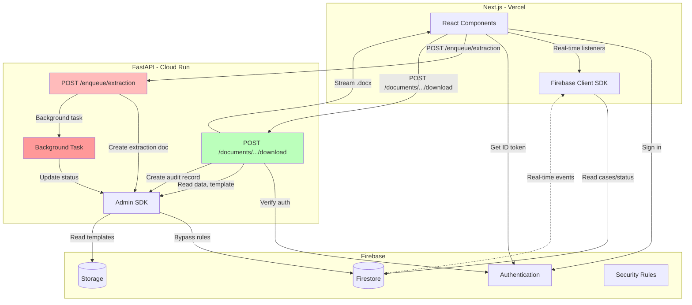

# System Architecture

## System Overview



## Component Responsibilities

### Next.js (Vercel)

**Client Components:**

- Firebase Auth (sign-in, sign-out, session management, ID token management)
- Real-time listeners (`onSnapshot`) for case status and extraction progress
- UI rendering (shadcn/ui components)
- Direct API calls to FastAPI with Firebase ID tokens

### Firebase

**Authentication:** Google OAuth  
**Firestore:** Case metadata, extraction results, generation audit logs, config collections  
**Storage:** Source documents (user-uploaded), templates (admin-uploaded)  
**Security Rules:** Read-only for authenticated users (filtered by userId), all writes blocked

### FastAPI (Cloud Run)

**API Endpoints:**

- `POST /enqueue/extraction` - Verify auth, create extraction doc, trigger background task, return extractionId
  - Called directly by client with Firebase ID token
  - Returns immediately (non-blocking)
  - Extraction runs in FastAPI BackgroundTasks

- `POST /documents/{caseId}/{templateId}/download` - Synchronous document generation
  - Verify Firebase ID token and case ownership
  - Aggregate latest extraction fields and user fields
  - Download template from Storage
  - Render .docx using python-docxtpl
  - Stream document directly to client (1-3 seconds)
  - Create audit record in `generations` collection
  - No storage of generated documents

**Background Tasks:**

- Extraction processing (GPT-4 Vision API, validation, Firestore updates)
- Runs in-process using FastAPI BackgroundTasks (not Cloud Tasks)

**Admin SDK:** All Firestore/Storage writes bypass Security Rules

**Note:** Cloud Tasks planned for future production deployment to enable retries, rate limiting, and durability at scale.

---

## Architecture Principles

### Separation of Concerns

**Client SDK for reads, Admin SDK for writes**

- Next.js Client SDK: Real-time listeners (`onSnapshot`), config reads
- Admin SDK: All writes (Server Actions + FastAPI workers)
- Rationale: Validation, rate limiting, audit trails happen server-side. Client cannot corrupt state.

**FastAPI for compute and API endpoints**

- Extraction: Async processing via background tasks, real-time status updates
- Generation: Synchronous streaming for fast user experience (1-3 seconds)
- All authentication verified via Firebase ID tokens
- Rationale: Balances user experience (fast downloads) with system reliability (async extraction)

### Data Architecture

**Top-level collections enable admin queries**

- Runtime data: `cases`, `extractions`, `generations` (top-level)
- Config data: `caseTypes` with subcollections (`sourceDocuments`, `templates`)
- Rationale: Query "all extractions by case type" without collection group queries. Denormalized `userId` enables cross-user admin panel queries.

**Subcollections only when never queried across parents**

- `cases/{caseId}/sourceDocuments` - always case-scoped
- Never need "all source documents across cases"
- Rationale: Keeps related data together without polluting top-level query space

**Denormalization for performance**

- `userId`, `caseTypeId` in extractions/generations
- `latestExtractionId` on sourceDocument
- Rationale: Eliminates joins, enables direct filtering, supports analytics

### Security Model

**Defense in depth**

- Firestore Rules: Block client writes, filter reads by `userId`
- Storage Rules: Deny all (Admin SDK + signed URLs only)
- Worker Auth: API keys in Secret Manager
- Rationale: Multiple layers, client cannot bypass validation

**Single source of truth**

- Firestore paths stored in documents, never constructed manually
- IDs in filenames for debugging, not for logic
- Rationale: Reduces coupling, easier to refactor paths

### Processing Patterns

**Async extraction via background tasks**

- Extraction runs in FastAPI BackgroundTasks after upload
- Real-time status updates via Firestore `onSnapshot`
- Rationale: Long-running GPT-4 Vision calls (5-15 seconds) shouldn't block upload response

**Synchronous generation**

- Documents generated on-demand during download request (1-3 seconds)
- Streamed directly to user, not stored
- Audit record created in `generations` collection
- Rationale: Fast enough for synchronous request, always uses latest data, no storage costs

**Real-time updates via Firestore**

- Background tasks update Firestore, `onSnapshot` updates UI
- No polling, no WebSockets
- Rationale: Firebase native pattern, offline support, automatic reconnection

**Future:** Cloud Tasks for production-scale extraction with retries, rate limiting, and durability

### Validation Strategy

**Two-tier validation (Python runtime)**

- JSON Schema: field-level (type, format, required)
- Custom validators: cross-field (date ordering, calculated values)
- Rationale: Declarative for simple cases, flexible for business logic

### Versioning & History

**Source documents: `isLatest` flag**

- New upload sets previous `isLatest: false`
- Preserves audit trail
- Rationale: Re-upload doesn't lose history, simple query for active doc

**Extractions: version number**

- Multiple extractions per case (prompt iterations)
- `version` increments, `extractionConfig` tracks parameters
- Rationale: Development needs re-extraction, production needs prompt evolution

**Generations: audit-only records**

- Track generation events for analytics and debugging
- No document storage - each download generates fresh with latest data
- Records include: templateId, status, durationMs, timestamp
- Rationale: Always current data, no stale documents, simpler architecture

**Templates: overwrite + version field**

- Simple path, version tracked in Firestore
- Rationale: No version sprawl in Storage, migrations handled by version field

### Soft Deletion

**Cases: `deletedAt` timestamp**

- User-driven, preserves data
- Rationale: Audit requirements, potential recovery

**Configs: `isActive` + `deletedAt`**

- `isActive`: Draft vs published, enabled vs disabled
- `deletedAt`: Soft deletion
- Rationale: Separates readiness from removal

### Timestamp Integrity

**Always use `serverTimestamp()`**

- Never trust client clock
- Rationale: Security (prevents backdating), consistency (timezone-agnostic)

---

## Technology Stack

| Layer      | Technology                                 | Hosting      |
| ---------- | ------------------------------------------ | ------------ |
| Frontend   | Next.js 15, React, shadcn/ui, Tailwind CSS | Vercel       |
| Backend    | FastAPI, Python 3.11                       | Cloud Run    |
| Database   | Firestore                                  | Firebase     |
| Storage    | Firebase Storage                           | Firebase     |
| Auth       | Firebase Authentication                    | Firebase     |
| Compute    | FastAPI BackgroundTasks                    | Cloud Run    |
| AI         | OpenAI GPT-4 Vision                        | —            |
| Deployment | Git-connected                              | Vercel + GCP |

---

## Data Flow Examples

### Case Creation + Upload

```
1. User fills case creation form (name)
   ↓
2. Server Action: createCase()
   - Firestore: Create case (status: draft, deletedAt: null)
   - Return caseId
   ↓
3. Client navigates to /cases/{caseId}
   - onSnapshot listener on case document
   ↓
4. User selects file
   ↓
5. Server Action: generateUploadUrl()
   - Generate docId, signed URL
   - Return to client
   ↓
6. Client: PUT file to Storage
   ↓
7. Client: POST /enqueue/extraction (with ID token)
   ↓
8. FastAPI: Create extraction doc, trigger background task
   ↓
9. Client onSnapshot: Status → "processing"
```

### Extraction Processing

```
1. FastAPI Background Task: run_extraction(extractionId)
   ↓
2. Background Task:
   - Update extraction (status: processing)
   - Download file from Storage
   - GPT-4 Vision extraction
   - JSON Schema + custom validation
   - Update extraction (fields, status: processed/failed/flagged)
   - Update sourceDocument (latestExtractionId, status)
   ↓
3. Client onSnapshot: Extraction complete, display fields
```

### Document Generation & Download

```
1. User clicks "Download" on template
   ↓
2. Client: Get Firebase ID token
   ↓
3. Client: POST /documents/{caseId}/{templateId}/download
   - Authorization: Bearer {idToken}
   ↓
4. FastAPI:
   - Verify ID token and case ownership
   - Verify latest extraction is processed
   - Aggregate fields from latest extractions
   - Get userFields from case document
   - Download template .docx from Storage
   - Render document using python-docxtpl
   - Create generation audit record (Firestore)
   - Stream .docx directly to client
   ↓
5. Browser: Download file automatically
   - File named per template's documentDownloadName
   - Completes in 1-3 seconds
```

**Benefits:**
- Always uses latest case data (no stale documents)
- Fast for small .docx files (1-3 seconds)
- No Storage costs for outputs
- Simpler architecture (no async workers, no status tracking)
- Audit trail preserved in generations collection

---

## Security Model

**Firestore Rules:**

- Config collections: Read by authenticated users
- User data: Read own only (`userId` match)
- All writes: Blocked (Admin SDK only)

**Storage Rules:**

- User attachments: Readable by authenticated case owner (verified via Firestore lookup)
- Templates: No public access (Admin SDK only)
- Generated documents: Not stored (streamed directly to users)

**API Authentication:**

- All FastAPI endpoints verify Firebase ID tokens
- Token contains userId used for authorization checks
- No API keys or worker authentication needed in current implementation

**Admin SDK Operations:**

- Bypass all Security Rules
- Used in Server Actions and FastAPI workers
- Trusted, already validated

---

## Current Implementation vs. Future Plans

**Current (MVP):**
- Extraction: FastAPI BackgroundTasks (in-process)
- Generation: Synchronous streaming (1-3 seconds)
- Authentication: Firebase ID tokens on all API calls
- Document storage: Templates only (outputs streamed, not stored)

**Planned Future Enhancements:**
- Cloud Tasks for extraction (retries, rate limiting, durability)
- API key authentication for worker endpoints
- Cloud Functions for Firestore triggers
- Admin panel (currently manual via Firestore Console)
- Multi-document cases (schema ready, enforced to 1 for now)
- Organization support (schema ready, null for now)

## Future-Proofing

Schema designed for:

- Admin cross-user queries (denormalized fields)
- Multi-document per case (subcollection + `isLatest`)
- Organization multi-tenancy (`organizationId` null)
- Template variations (reference fields, not hard requirements)
- Prompt evolution (versioned extractions)
